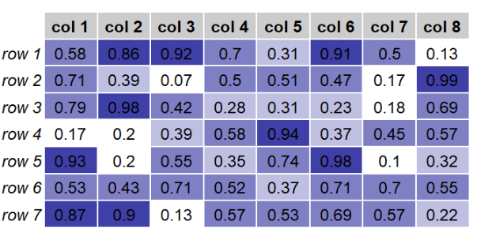

<!-- Improved compatibility of back to top link: See: https://github.com/othneildrew/Best-README-Template/pull/73 -->

<!-- PROJECT LOGO -->
 

<h3 align="center">R Heatmap Generator: Visualize Data with MyHeatMap Function </h3>

  

    Department of Bioinformatics, IBB, University of Tehran
     
  

  

<!-- ABOUT THE PROJECT -->
## Heatmap Generator in R

Unlock powerful data visualization in R with the "MyHeatMap" function. This repository provides a versatile R script for generating heatmaps, offering a dynamic representation of your data. Utilize color gradients to highlight patterns, trends, and variations within your matrix. Whether you're exploring gene expression, analyzing experimental results, or studying complex datasets, this heatmap generator enhances your ability to communicate insights effectively.

(<a href="#readme-top">back to top</a>)

## Languages Used

R Packages 

(<a href="#readme-top">back to top</a>)

## Key Features:
<ol>
  <li>
    Data Processing:
    <ul type='disc'>
      <li>The input matrix is processed to scale values between 0 and 1.</li>
    </ul>
  </li>
  <li>
    Color Palette Setup:
    <ul type='disc'>
      <li>
        A color palette is created, ranging from white to dark blue.
      </li>
      <li>
        Colors are assigned to specific value ranges in the matrix.
      </li>
    </ul>
  </li>
  <li>
    Table Theme Setup:
    <ul type='disc'>
      <li>
        The table theme is customized to use the assigned colors for background filling.
      </li>
    </ul>
  </li>
  <li>
    Grid Table Creation:
    <ul type='disc'>
      <li>
        The processed data is displayed as a grid table using the defined theme.
      </li>
    </ul>
  </li>
</ol>

## Usage:
 <ul type='disc'>
   <li>
     The function takes a matrix of data as input and generates a heatmap based on the color assignments.
   </li>
   <li>
     Example data is randomly generated to demonstrate the functionality.
   </li>
 </ul>

## How to Use:
<ol>
  <li>
    Import the required libraries: gridExtra and grid.
  </li>
  <li>
    Define or import a matrix of data.
  </li>
  <li>Call the MyHeatMap function with the data matrix as an argument.
  </li>
</ol>

## Customization:
Users can customize the color palette and theme parameters for different visual effects.

## Note:
It's advisable to include comments in the code for better readability and understanding.

## Example:
The code includes an example of generating random data and calling the MyHeatMap function to visualize the heatmap.

(<a href="#readme-top">back to top</a>)

(<a href="#readme-top">back to top</a>)

## Dependencies:

The code relies on the grid and gridExtra packages, so ensure they are installed before running the script.
Author:

Fatemeh vafaee sharbaf
Feel free to incorporate this description into your GitHub repository's README file. 

<!-- CONTACT -->
## Contact

Vafaeeshaarbaf - @gmail.com

(<a href="#readme-top">back to top</a>)

<!-- ACKNOWLEDGMENTS -->
## Acknowledgments

Department of Bioinformatics, IBB, University of Tehran

(<a href="#readme-top">back to top</a>)

<!-- MARKDOWN LINKS & IMAGES -->
<!-- https://www.markdownguide.org/basic-syntax/#reference-style-links -->
[contributors-shield]: https://img.shields.io/github/contributors/github_username/repo_name.svg?style=for-the-badge
[contributors-url]: https://github.com/github_username/repo_name/graphs/contributors
[forks-shield]: https://img.shields.io/github/forks/github_username/repo_name.svg?style=for-the-badge
[forks-url]: https://github.com/github_username/repo_name/network/members
[stars-shield]: https://img.shields.io/github/stars/github_username/repo_name.svg?style=for-the-badge
[stars-url]: https://github.com/github_username/repo_name/stargazers
[issues-shield]: https://img.shields.io/github/issues/github_username/repo_name.svg?style=for-the-badge
[issues-url]: https://github.com/github_username/repo_name/issues
[license-shield]: https://img.shields.io/github/license/github_username/repo_name.svg?style=for-the-badge
[license-url]: https://github.com/github_username/repo_name/blob/master/LICENSE.txt
[linkedin-shield]: https://img.shields.io/badge/-LinkedIn-black.svg?style=for-the-badge&logo=linkedin&colorB=555
[linkedin-url]: https://linkedin.com/in/linkedin_username
[product-screenshot]: images/screenshot.png
[Next.js]: https://img.shields.io/badge/next.js-000000?style=for-the-badge&logo=nextdotjs&logoColor=white
[Next-url]: https://nextjs.org/
[React.js]: https://img.shields.io/badge/React-20232A?style=for-the-badge&logo=react&logoColor=61DAFB
[React-url]: https://reactjs.org/
[Vue.js]: https://img.shields.io/badge/Vue.js-35495E?style=for-the-badge&logo=vuedotjs&logoColor=4FC08D
[Vue-url]: https://vuejs.org/
[Angular.io]: https://img.shields.io/badge/Angular-DD0031?style=for-the-badge&logo=angular&logoColor=white
[Angular-url]: https://angular.io/
[Svelte.dev]: https://img.shields.io/badge/Svelte-4A4A55?style=for-the-badge&logo=svelte&logoColor=FF3E00
[Svelte-url]: https://svelte.dev/
[Laravel.com]: https://img.shields.io/badge/Laravel-FF2D20?style=for-the-badge&logo=laravel&logoColor=white
[Laravel-url]: https://laravel.com
[Bootstrap.com]: https://img.shields.io/badge/Bootstrap-563D7C?style=for-the-badge&logo=bootstrap&logoColor=white
[Bootstrap-url]: https://getbootstrap.com
[JQuery.com]: https://img.shields.io/badge/jQuery-0769AD?style=for-the-badge&logo=jquery&logoColor=white
[JQuery-url]: https://jquery.com 
